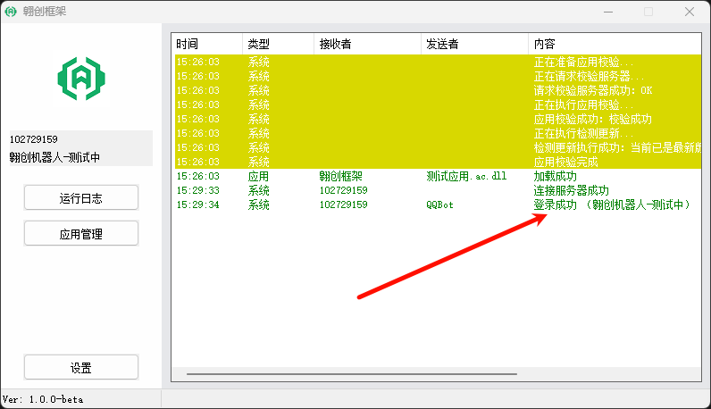
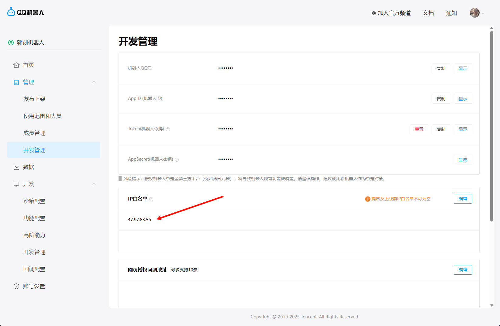
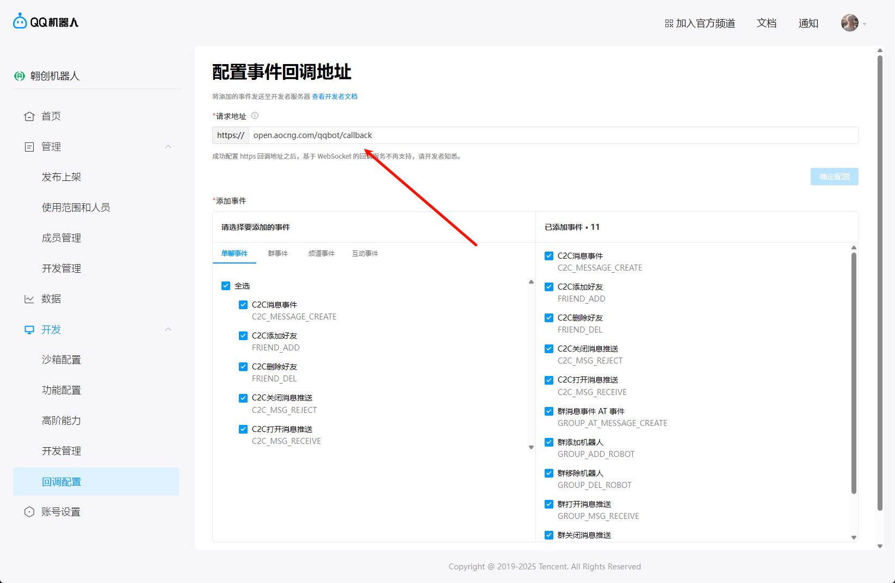

---
prev:
    text: 概览
    link: /framework
next: false
---
# 快速开始

使用框架必须先进行必要的配置，才能正常使用

## 必要配置

QQ机器人平台设置回调配置前必须先登录框架

### 桌面端框架

在左侧输入 AppID 和 AppSecret，点击登录

日志中会显示登录成功的信息。

## QQ机器人平台设置

进入 [QQ机器人平台]()

### 第一步

点击左侧的 “开发管理” 配置IP白名单

添加IP白名单：47.97.83.56

### 第二步

设置 “回调配置” 必须使用框架登录机器人

点击左侧的 “回调配置” 配置事件回调地址

设置请求地址为：open.aocng.com/qqbot/callback

## 最后

如果框架没有获取到机器人昵称、头像等信息，在以上设置完成后重新登录即可

没有获取到机器人信息的原因是因为首次登录没有配置IP白名单导致请求机器人信息失败